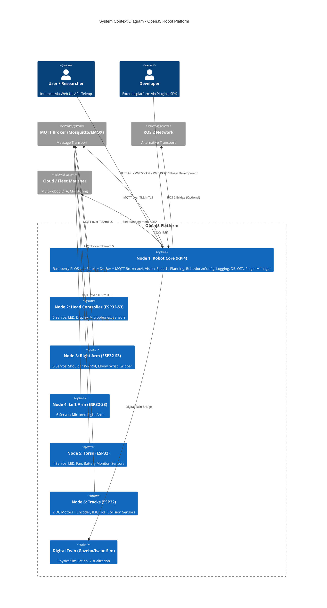
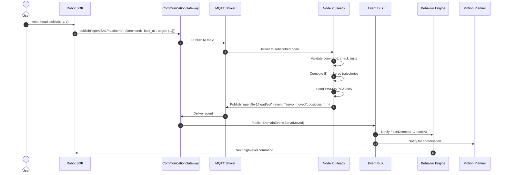
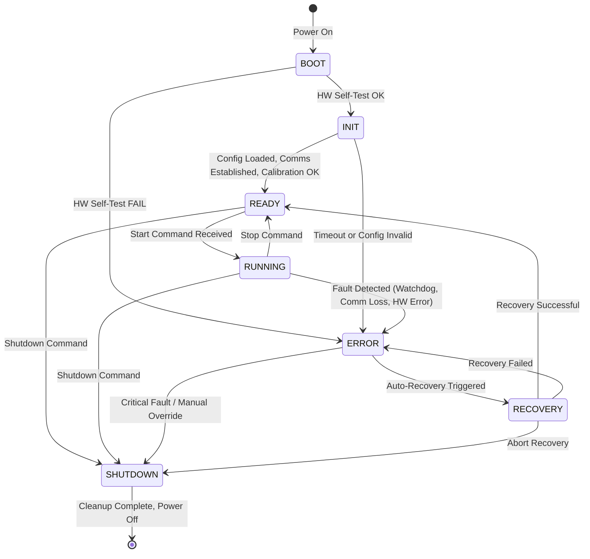
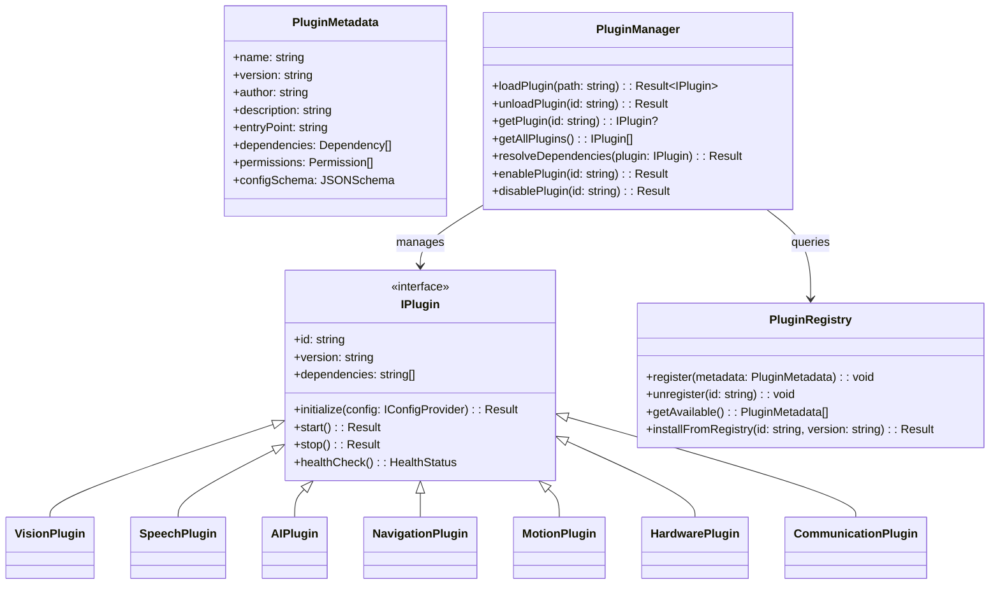
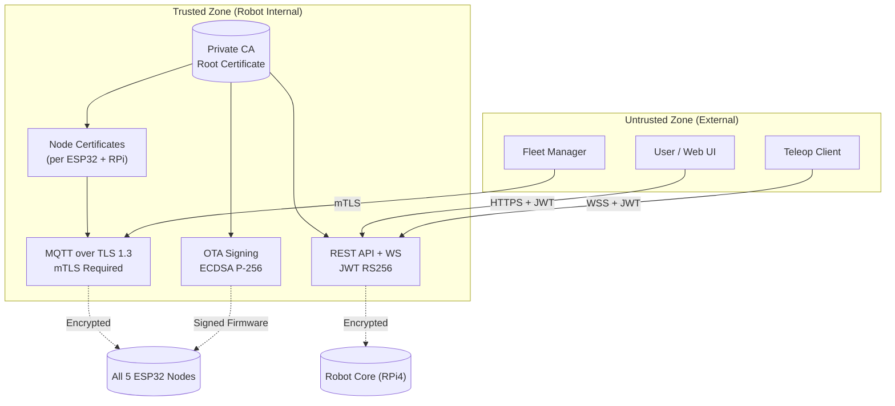

# OpenJ5 Architecture Documentation

## Overview

OpenJ5 follows **Hexagonal Architecture (Ports & Adapters)** with **Domain-Driven Design (DDD)**, **Event-Driven Architecture**, and **Plugin Architecture**. The system is composed of 6 distributed nodes communicating through an abstract Communication Gateway.

---

## System Context Diagram



---

## Container Diagram (Node 1 - Robot Core)

```mermaid
C4Container
    title Container Diagram - Node 1: Robot Core (Raspberry Pi 4)

    Container_Boundary(robot_core, "Robot Core") {
        Container(config_svc, "Configuration Service", "Python/FastAPI", "Hot-reload JSON/YAML/DB config, Schema validation")
        Container(logging_svc, "Logging Service", "Python/Structlog", "Structured JSON logs, Correlation IDs, Log aggregation")
        Container(db, "Database (SQLite/PostgreSQL)", "SQLAlchemy", "Robot state, Events, Calibration, Telemetry")
        Container(event_bus, "Event Bus", "Redis Streams / NATS", "Pub/Sub typed events, Dead letter, Replay")
        Container(plugin_mgr, "Plugin Manager", "Python/Importlib", "Dynamic load/unload, Versioning, Dependencies")
        Container(ota_mgr, "OTA Manager", "Python", "Signed firmware deploy, Rollback, Staged rollout")
        Container(scheduler, "Task Scheduler", "APScheduler", "Cron/Interval tasks, Health checks, Maintenance")
        Container(robot_core_svc, "Robot Core Service", "Python/FastAPI", "Orchestration, State Machine, Health")
        Container(rest_api, "REST API + WebSocket", "FastAPI + Uvicorn", "OpenAPI/Swagger, Auth JWT, Rate limiting")
        Container(mqtt_broker, "MQTT Broker", "Mosquitto/EMQX", "TLS, ACL, Persistent sessions, Bridge to ROS2")
        Container(ros2_bridge, "ROS 2 Bridge", "rosbridge_suite", "WebSocket ↔ ROS 2 topics/services/actions")
        Container(digital_twin, "Digital Twin Bridge", "Python", "Gazebo/Isaac Sim ↔ Robot Core sync")
    }

    Container(node2, "Node 2: Head", "ESP-IDF/C++", "MQTT Client")
    Container(node3, "Node 3: Right Arm", "ESP-IDF/C++", "MQTT Client")
    Container(node4, "Node 4: Left Arm", "ESP-IDF/C++", "MQTT Client")
    Container(node5, "Node 5: Torso", "ESP-IDF/C++", "MQTT Client")
    Container(node6, "Node 6: Tracks", "ESP-IDF/C++", "MQTT Client")
    Container(sim, "Digital Twin", "Gazebo/Isaac Sim", "ROS 2 / gRPC")

    Rel(robot_core_svc, config_svc, "Gets config")
    Rel(robot_core_svc, logging_svc, "Logs to")
    Rel(robot_core_svc, db, "Persists state/events")
    Rel(robot_core_svc, event_bus, "Publishes/Subscribes events")
    Rel(robot_core_svc, plugin_mgr, "Manages plugins")
    Rel(robot_core_svc, ota_mgr, "Triggers OTA")
    Rel(robot_core_svc, scheduler, "Schedules tasks")
    Rel(robot_core_svc, mqtt_broker, "Publishes/Subscribes via Gateway")
    Rel(robot_core_svc, digital_twin, "Syncs state")
    Rel(rest_api, robot_core_svc, "Calls internal API")
    Rel(rest_api, event_bus, "WebSocket event stream")
    Rel(mqtt_broker, node2, "MQTT over TLS")
    Rel(mqtt_broker, node3, "MQTT over TLS")
    Rel(mqtt_broker, node4, "MQTT over TLS")
    Rel(mqtt_broker, node5, "MQTT over TLS")
    Rel(mqtt_broker, node6, "MQTT over TLS")
    Rel(ros2_bridge, sim, "ROS 2 topics")
    Rel(digital_twin, sim, "State sync")
```



---

## Component Diagram - Core Domain (Hexagonal Architecture)

```mermaid
C4Component
    title Component Diagram - Core Domain (Hexagonal Architecture)

    Container_Boundary(domain, "Domain Layer (Zero External Deps)") {
        Component(entities, "Entities", "Robot, Node, Servo, Motor, Sensor, Battery, Plugin")
        Component(value_objects, "Value Objects", "Angle, Position, Velocity, Quaternion, Temperature, Voltage")
        Component(domain_events, "Domain Events", "NodeStateChanged, ServoMoved, CommandReceived, ErrorOccurred")
        Component(repositories, "Repository Interfaces", "IRobotRepository, INodeRepository, IConfigRepository, IEventStore")
        Component(services, "Domain Services", "KinematicsService, MotionPlanner, CollisionAvoidance, BatteryManager")
        Component(policies, "Policies / Rules", "SafetyPolicy, MotionLimitsPolicy, PowerBudgetPolicy")
    }

    Container_Boundary(application, "Application Layer") {
        Component(use_cases, "Use Cases / Commands", "MoveHead, MoveArm, MoveTracks, SayText, LoadPlugin, DeployOTA")
        Component(queries, "Queries", "GetRobotState, GetNodeHealth, GetServoPosition, GetBatteryLevel")
        Component(event_handlers, "Event Handlers", "OnFaceDetected, OnBatteryLow, OnNodeError, OnCommandReceived")
        Component(command_bus, "Command Bus", "Dispatches commands to handlers")
        Component(query_bus, "Query Bus", "Dispatches queries to handlers")
    }

    Container_Boundary(infrastructure, "Infrastructure Layer (Adapters)") {
        Component(mqtt_gateway, "MQTT Gateway Adapter", "Implements ICommunicationGateway")
        Component(ros2_gateway, "ROS 2 Gateway Adapter", "Implements ICommunicationGateway")
        Component(ws_gateway, "WebSocket Gateway Adapter", "Implements ICommunicationGateway")
        Component(redis_event_bus, "Redis Event Bus Adapter", "Implements IEventBus")
        Component(sqlite_repo, "SQLite Repository Adapter", "Implements IRepository")
        Component(file_config, "File Config Adapter", "Implements IConfigProvider (JSON/YAML)")
        Component(pca9685_driver, "PCA9685 Driver Adapter", "Implements IServoDriver")
        Component(l298n_driver, "L298N Driver Adapter", "Implements IMotorDriver")
        Component(vl53l0x_driver, "VL53L0X Driver Adapter", "Implements IDistanceSensor")
        Component(mpu6050_driver, "MPU6050 Driver Adapter", "Implements IIMU")
        Component(plugin_loader, "Plugin Loader", "Implements IPluginManager")
        Component(ota_adapter, "OTA Adapter", "Implements IOTAManager")
    }

    Container_Boundary(sdk, "Robot SDK (Facade)") {
        Component(robot_facade, "Robot Facade", "High-level API: robot.head.lookAt(), robot.arm.wave()")
        Component(head_api, "Head API", "lookAt, home, nod, shake, blink, scan")
        Component(arm_api, "Arm API", "wave, point, grab, release, reach, home")
        Component(tracks_api, "Tracks API", "moveForward, rotate, moveTo, stop, dock")
        Component(speech_api, "Speech API", "say, listen, setVoice, setLanguage")
        Component(behavior_api, "Behavior API", "idle, followPerson, sleep, dance")
    }

    Rel(robot_facade, head_api, "Delegates to")
    Rel(robot_facade, arm_api, "Delegates to")
    Rel(robot_facade, tracks_api, "Delegates to")
    Rel(robot_facade, speech_api, "Delegates to")
    Rel(robot_facade, behavior_api, "Delegates to")

    Rel(head_api, command_bus, "Sends MoveHeadCommand")
    Rel(arm_api, command_bus, "Sends MoveArmCommand")
    Rel(tracks_api, command_bus, "Sends MoveTracksCommand")
    Rel(speech_api, command_bus, "Sends SayTextCommand")
    Rel(behavior_api, command_bus, "Sends BehaviorCommand")

    Rel(command_bus, use_cases, "Routes to handler")
    Rel(query_bus, queries, "Routes to handler")

    Rel(use_cases, entities, "Creates/Updates")
    Rel(use_cases, domain_events, "Emits")
    Rel(use_cases, repositories, "Persists via interface")
    Rel(use_cases, services, "Uses domain logic")
    Rel(use_cases, policies, "Validates against rules")

    Rel(event_handlers, domain_events, "Handles")
    Rel(event_handlers, command_bus, "May emit commands")
    Rel(event_handlers, services, "Uses domain logic")

    Rel(mqtt_gateway, use_cases, "Receives commands via Gateway")
    Rel(ros2_gateway, use_cases, "Receives commands via Gateway")
    Rel(ws_gateway, use_cases, "Receives commands via Gateway")

    Rel(redis_event_bus, event_bus, "Implements")
    Rel(sqlite_repo, repositories, "Implements")
    Rel(file_config, config_svc, "Implements")
    Rel(pca9685_driver, hal, "Implements IServoDriver")
    Rel(l298n_driver, hal, "Implements IMotorDriver")
    Rel(vl53l0x_driver, hal, "Implements IDistanceSensor")
    Rel(mpu6050_driver, hal, "Implements IIMU")
```

---

## Communication Flow - Command & Event



---

## Data Flow - Configuration

```mermaid
flowchart TD
    subgraph Config_Sources["Configuration Sources"]
        JSON[("JSON Files\nconfig/nodeX/")]
        YAML[("YAML Files\nconfig/common/")]
        DB[("Database\nPostgreSQL/SQLite")]
        ENV[("Environment Variables\nSecrets, Overrides")]
        REMOTE[("Config Service\nConsul/et/Etcd - Future")]
    end

    subgraph Config_Service["Configuration Service (Node 1)"]
        LOADER[Config Loader\nPriority: ENV > DB > YAML > JSON]
        VALIDATOR[Schema Validator\nJSON Schema / Pydantic]
        CACHE[Hot-Reload Cache\nWatchers + Invalidation]
        PROVIDER[IConfigProvider\nget(key), watch(key, callback)]
    end

    subgraph Consumers["Consumers (All Nodes)"]
        NODE1[Node 1: Robot Core]
        NODE2[Node 2: Head]
        NODE3[Node 3: Right Arm]
        NODE4[Node 4: Left Arm]
        NODE5[Node 5: Torso]
        NODE6[Node 6: Tracks]
        PLUGINS[Plugins]
        DRIVERS[Hardware Drivers]
    end

    JSON --> LOADER
    YAML --> LOADER
    DB --> LOADER
    ENV --> LOADER
    REMOTE -.-> LOADER

    LOADER --> VALIDATOR
    VALIDATOR --> CACHE
    CACHE --> PROVIDER

    PROVIDER --> NODE1
    PROVIDER --> NODE2
    PROVIDER --> NODE3
    PROVIDER --> NODE4
    PROVIDER --> NODE5
    PROVIDER --> NODE6
    PROVIDER --> PLUGINS
    PROVIDER --> DRIVERS
```

---

## State Machine - Per Node



---

## Deployment Diagram

```mermaid
C4Deployment
    title Deployment Diagram - OpenJ5 Physical Layout

    Deployment_Node(rpi4, "Raspberry Pi 4 8GB", "Raspberry Pi OS Lite 64-bit (Bookworm), NVMe USB3") {
        Container(docker, "Docker Engine", "Container Runtime") {
            Container(mosquitto, "Mosquitto MQTT", "Port 8883 (TLS)")
            Container(redis, "Redis Stack", "Port 6379 (Streams)")
            Container(postgres, "PostgreSQL 16", "Port 5432")
            Container(robot_core, "Robot Core Service", "Port 8080 (REST), 8081 (WS)")
            Container(ros2_bridge, "ROS 2 Bridge", "Port 9090 (WS)")
            Container(gazebo, "Gazebo Headless", "Port 11345 (gz-transport)")
        }
    }

    Deployment_Node(esp32_2, "ESP32-S3 Node 2: Head", "ESP-IDF 5.2 FreeRTOS") {
        Component(pca9685_2, "PCA9685 (I2C 0x40)", "16ch PWM")
        Component(servos_2, "6x Servos", "Neck Y/P/R, Eyes H/V, Eyelids")
        Component(leds_2, "WS2812 LED Strip", "GPIO 48")
        Component(display_2, "OLED/TFT Display", "SPI/I2C")
        Component(mics_2, "2x I2S MEMS Mic", "I2S")
        Component(sensors_2, "IMU, ToF, Temp", "I2C")
    }

    Deployment_Node(esp32_3, "ESP32-S3 Node 3: Right Arm", "ESP-IDF 5.2 FreeRTOS") {
        Component(pca9685_3, "PCA9685 (I2C 0x41)", "16ch PWM")
        Component(servos_3, "6x Servos", "Shoulder P/R/Rot, Elbow, Wrist, Gripper")
    }

    Deployment_Node(esp32_4, "ESP32-S3 Node 4: Left Arm", "ESP-IDF 5.2 FreeRTOS") {
        Component(pca9685_4, "PCA9685 (I2C 0x42)", "16ch PWM")
        Component(servos_4, "6x Servos", "Mirrored Right Arm")
    }

    Deployment_Node(esp32_5, "ESP32 Node 5: Torso", "ESP-IDF 5.2 FreeRTOS") {
        Component(pca9685_5, "PCA9685 (I2C 0x43)", "16ch PWM")
        Component(servos_5, "4x Servos", "Torso Rot/Pitch, Battery Door, Expansion")
        Component(leds_5, "LED Strip + Fan PWM", "GPIO")
        Component(battery_5, "INA219 + DS18B20", "I2C/1-Wire")
        Component(sensors_5, "IMU, ToF, Proximity", "I2C")
    }

    Deployment_Node(esp32_6, "ESP32 Node 6: Tracks", "ESP-IDF 5.2 FreeRTOS") {
        Component(l298n_6, "L298N Driver", "GPIO PWM + Dir")
        Component(motors_6, "2x DC Motor + Encoder", "GPIO Interrupts")
        Component(imu_6, "MPU6050/ICM20948", "I2C")
        Component(tof_6, "VL53L0X x2", "I2C (Mux)")
        Component(collision_6, "IR Bumpers", "GPIO")
    }

    Deployment_Node(network, "Network Infrastructure", "WiFi 5/6 + Ethernet") {
        Component(wifi_ap, "WiFi Access Point", "WPA3 Enterprise")
        Component(switch, "Managed Switch", "VLANs: Robot, Mgmt, IoT")
        Component(router, "Router/Firewall", "VPN, mTLS Termination")
    }

    Rel(rpi4, network, "Ethernet 1Gbps")
    Rel(esp32_2, network, "WiFi 2.4GHz (MQTT TLS)")
    Rel(esp32_3, network, "WiFi 2.4GHz (MQTT TLS)")
    Rel(esp32_4, network, "WiFi 2.4GHz (MQTT TLS)")
    Rel(esp32_5, network, "WiFi 2.4GHz (MQTT TLS)")
    Rel(esp32_6, network, "WiFi 2.4GHz (MQTT TLS)")

    Rel(mosquitto, esp32_2, "MQTT over TLS/mTLS")
    Rel(mosquitto, esp32_3, "MQTT over TLS/mTLS")
    Rel(mosquitto, esp32_4, "MQTT over TLS/mTLS")
    Rel(mosquitto, esp32_5, "MQTT over TLS/mTLS")
    Rel(mosquitto, esp32_6, "MQTT over TLS/mTLS")
```

---

## Plugin Architecture



---

## Hardware Abstraction Layer (HAL)

```mermaid
classDiagram
    class IServoDriver {
        <<interface>>
        +initialize(config: ServoConfig): Result
        +setPosition(channel: int, angle: float, speed: float): Result
        +getPosition(channel: int): float
        +setSpeed(channel: int, speed: float): Result
        +home(channel: int): Result
        +enable(channel: int): Result
        +disable(channel: int): Result
        +calibrate(channel: int, min: int, max: int, home: int): Result
        +shutdown(): void
    }

    class IMotorDriver {
        <<interface>>
        +initialize(config: MotorConfig): Result
        +setVelocity(motor: MotorId, velocity: float): Result
        +getVelocity(motor: MotorId): float
        +setPID(motor: MotorId, pid: PIDConfig): Result
        +enable(motor: MotorId): Result
        +disable(motor: MotorId): Result
        +brake(motor: MotorId): Result
        +getOdometry(): OdometryData
        +shutdown(): void
    }

    class IDistanceSensor {
        <<interface>>
        +initialize(config: SensorConfig): Result
        +readDistance(): DistanceReading
        +startContinuous(intervalMs: int): Result
        +stopContinuous(): Result
        +setThreshold(threshold: float, callback: Fn): Result
    }

    class IIMU {
        <<interface>>
        +initialize(config: IMUConfig): Result
        +getOrientation(): Quaternion
        +getAngularVelocity(): Vector3
        +getLinearAcceleration(): Vector3
        +calibrate(): Result
        +setFusionAlgorithm(algo: FusionAlgo): Result
    }

    class ICameraDriver {
        <<interface>>
        +initialize(config: CameraConfig): Result
        +capture(): ImageFrame
        +startStream(callback: Fn): Result
        +stopStream(): Result
        +setResolution(w: int, h: int): Result
        +setFPS(fps: int): Result
    }

    IServoDriver <|-- PCA9685Driver
    IServoDriver <|-- SoftPWMDriver
    IServoDriver <|-- ESP32LECDriver
    IServoDriver <|-- GazeboServoDriver

    IMotorDriver <|-- L298NDriver
    IMotorDriver <|-- TB6612Driver
    IMotorDriver <|-- BTS7960Driver
    IMotorDriver <|-- ODriveDriver
    IMotorDriver <|-- GazeboMotorDriver

    IDistanceSensor <|-- VL53L0XDriver
    IDistanceSensor <|-- UltrasonicDriver
    IDistanceSensor <|-- GazeboDistanceDriver

    IIMU <|-- MPU6050Driver
    IIMU <|-- ICM20948Driver
    IIMU <|-- GazeboIMUDriver

    ICameraDriver <|-- V4L2CameraDriver
    ICameraDriver <|-- IPCameraDriver
    ICameraDriver <|-- GazeboCameraDriver
```



---

## Security Architecture



---

## ADR Index

| ADR | Title | Status | Date |
|-----|-------|--------|------|
| ADR-001 | Hexagonal Architecture for Core Domain | Accepted | 2026-07-15 |
| ADR-002 | 6-Node Distributed Architecture | Accepted | 2026-07-15 |
| ADR-003 | Communication Gateway Pattern (Multi-Protocol) | Accepted | 2026-07-15 |
| ADR-004 | Event-Driven Architecture with Central Event Bus | Accepted | 2026-07-15 |
| ADR-005 | Hardware Abstraction Layer (HAL) for All Drivers | Accepted | 2026-07-15 |
| ADR-006 | Robot SDK as Single Facade for Applications | Accepted | 2026-07-15 |
| ADR-007 | Plugin Architecture for All Features | Accepted | 2026-07-15 |
| ADR-008 | Configuration-Driven Development (JSON/YAML Only) | Accepted | 2026-07-15 |
| ADR-009 | State Machine per Node (BOOT→INIT→READY→RUNNING→ERROR→RECOVERY→SHUTDOWN) | Accepted | 2026-07-15 |
| ADR-010 | Digital Twin Native (Gazebo/Isaac Sim) | Accepted | 2026-07-15 |
| ADR-011 | OTA with Signed Firmware and Rollback | Accepted | 2026-07-15 |
| ADR-012 | FreeCAD Parametric CAD with Spreadsheet Configuration | Accepted | 2026-07-15 |
| ADR-013 | Security: mTLS, JWT, Signed OTA, Fail-Safe | Accepted | 2026-07-15 |
| ADR-016 | Raspberry Pi OS Lite 64-bit (Bookworm) + NVMe-over-USB3 for Node 1 | Accepted | 2026-08-25 |

---

## Quality Gates (Automated in CI/CD)

| Gate | Tool | Threshold |
|------|------|-----------|
| **Build** | CMake/ESP-IDF/Poetry | Must pass |
| **Unit Tests** | pytest/Unity/Catch2 | >90% coverage (core), >80% (plugins) |
| **Integration Tests** | pytest + testcontainers | All pass |
| **Static Analysis** | ruff/mypy/cppcheck/clang-tidy | Zero errors, zero critical warnings |
| **Architecture Tests** | ArchUnit/custom | No layer violations, no circular deps |
| **Documentation Check** | Custom script | All modified files have doc updates |
| **ADR Check** | Custom script | Architectural changes have ADR |
| **Security Scan** | bandit/trivy/semgrep | Zero critical/high |
| **Dependency Check** | pip-audit/cargo-audit | Zero known vulnerabilities |
| **Simulation Tests** | Gazebo + pytest | Parity with real robot tests |

---

## Technology Stack Summary

| Layer | Technology | Version |
|-------|------------|---------|
| **Core Language (Robot Core)** | Python | 3.11+ |
| **Core Language (Firmware)** | C++ | C++20 (ESP-IDF) |
| **SDK Languages** | Python, C++, TypeScript | 3.11+, 20, 5.0+ |
| **Message Transport** | MQTT (Mosquitto/EMQX) | 5.0 / 2.0 |
| **Alternative Transport** | ROS 2 (Fast DDS/Cyclone) | Humble/Iron |
| **Event Bus** | Redis Streams / NATS | 7.2+ / 2.10+ |
| **Database** | SQLite (dev) / PostgreSQL | 3.45+ / 16+ |
| **Config** | JSON / YAML / Pydantic | - |
| **Web Framework** | FastAPI + Uvicorn | 0.110+ / 0.30+ |
| **Containerization** | Docker + Compose | 26+ / 2.27+ |
| **CAD** | FreeCAD | 0.21+ |
| **Electronics** | KiCad | 8.0+ |
| **Simulation** | Gazebo Garden / Isaac Sim | Harmonic / 2023.1+ |
| **CI/CD** | GitHub Actions | - |
| **Testing** | pytest, Unity, Catch2, Gazebo | - |
| **Observability** | Prometheus, Grafana, OpenTelemetry | - |